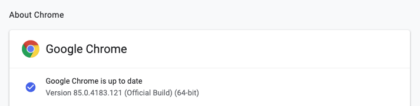

# Python Selenium 自動化爬取大量圖片

透過 Python 自動化工具 Selenium 來完成爬蟲。

## 安裝Selenium
```
pip install selenium
```

## 下載 Webdriver 驅動
Selenium 透過網頁瀏覽器來模擬畫面，因此需要下載瀏覽器的驅動才能模擬。Webdriver 包括 Chrome、Safari、Firefox 等瀏覽器可以使用。下面範例以 Chrome 做示範。

首先我們先查看目前電腦裡的 chrome 瀏覽器是什麼版本，需要下載對應版本的 webdriver。ChromeDriver 可以來[這裏](https://chromedriver.chromium.org/downloads)下載。

